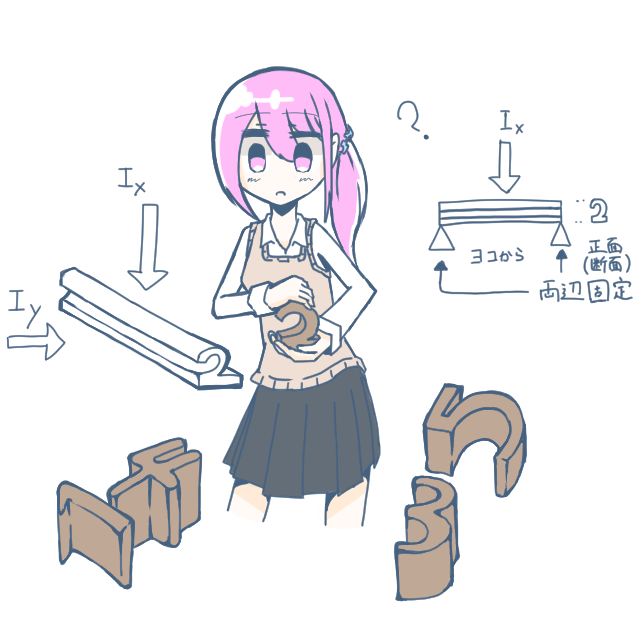

# Danmen-GAN

</img>

# Directory

- ExperimentalResults: 実験によって生まれたもの
  - 実験名: `I`+`(x|y|r)` + `(+|-)` + `param` という感じ、途中ちょっと変わったりするけど、問題ないはず
  - `GeneratedImages`: 実験ごとにディレクトリが分岐している
  - `loss_curves`: ロスカーブやスコアの学習時の変遷。間違えて iterationx1000 という横軸が書いてあるが、実際のスケールに反映するの忘れてた。
  - `model_images`: Generator/Discriminator のグラフ
  - `results_score`: 各スコアを保存したマークダウン
  - `training_parameters`: 各パラメータを保存したマークダウン
  - `weight_hdf5`: 重み。最後の方に保存し始めたので序盤のものはない。

- Colaboratory: Colaboratory でサクッと試してみたいときに使えるコード。実験の最終コード。
- calcstats: 統計値を計算するためのファイル。最初に作ったのはこれ。Numpy と TensorFlow 版があり、両方の計算が一致するか確かめられる。Numpy側はテンソル計算に対応してない。
- Blender: Blender 側で数字を生成するためのコード 。今回は Windows で行い、GPU (GTX1070) で動かした。ローカルマシンにも TensorFlow が必要になる。

# 反省点

- 実験を一度しか回せず、スコアの信用性が低い (これは計算資源の限界なので許されたい)
- 学習の過程でのスコアの最大値、などを取っているが、学習の序盤にかなりそれらが上下するタイミングがあるので、それを完全に除外してスコアを計算するべきだった
